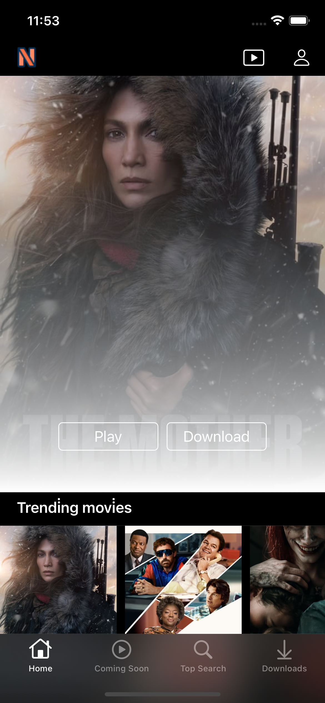
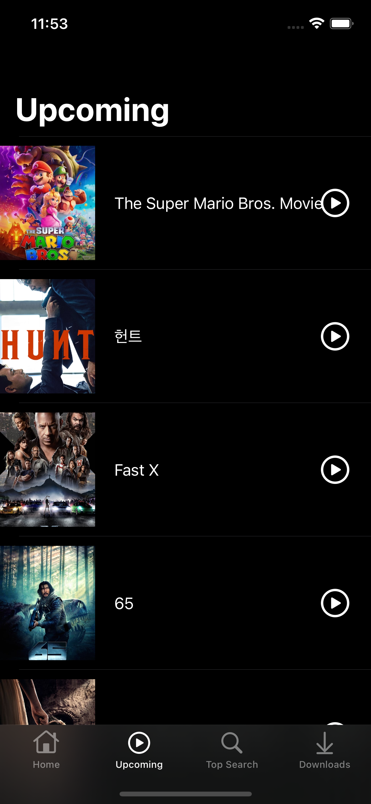
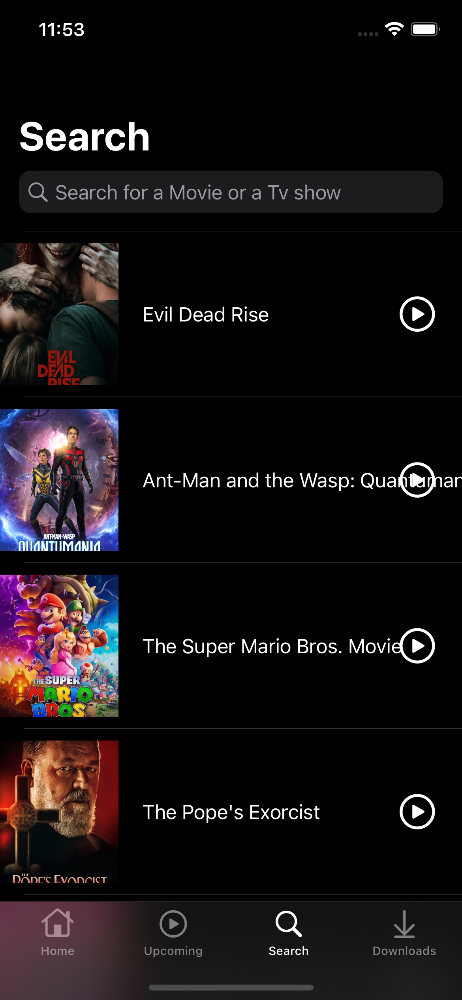

# nFlix

## Overview

nFlix is a Netflix clone app that allows users to browse and discover movies and TV shows. The app utilizes the TMDB and YouTube APIs for fetching movie data and trailers, respectively. It features a tab bar interface with tabs for Home, Upcoming, and Search. The app also incorporates CoreData to provide offline storage for data.

## Installation

1. Clone or download the repository to your local machine.
2. Open the `nFlix.xcodeproj` file in Xcode.
3. Select a simulator or a physical device to run the app on.
4. Click the "Run" button in Xcode to build and run the app.

> Note: Make sure you have a working internet connection and valid API keys for the TMDB and YouTube APIs. Update the API keys in Managers/Constants.swift file before running the app.

```swift
static let API_KEY = "TMDB_API_KEY"
static let YoutubeAPI_KEY = "YOUTUBEAPI_KEY"
```

## Features

- Tab bar interface with Home, Upcoming, and Search tabs.
- Fetches movie data from the TMDB API.
- Displays movie trailers using the YouTube API.
- CoreData integration for offline storage of data.
- Supports searching for movies and TV shows.
- Provides information about upcoming movies.

## GIF

<div>

</div>

## Screenshots

<div>



</div>

## Dependencies

- [TMDB API](https://www.themoviedb.org/documentation/api)
- [YouTube API](https://developers.google.com/youtube/v3)
- CoreData

## Next Steps-Todo

- [ ] Implement user authentication and user profiles.
- [ ] Add a favorites feature to allow users to save their favorite movies and TV shows.
- [ ] Improve the UI and UX of the app.
- [ ] Implement recommendations based on user preferences.
- [ ] Enhance search functionality with filters and sorting options.
